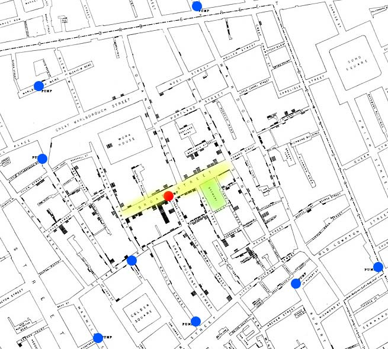

## この授業の目標

::: {.v-center}

- 解決したい問題を見つける

- 「データ分析」を通して問題の原因を探る

- 解決策を見出す

:::

------------------------------------------------------------------------

## 偉大な先人から学ぶ

:::: {.v-center}

::: {.small-text08}

- 19世紀半ばのロンドンでコレラが大流行、多くの死者が出る（**社会問題**）

- コレラが流行する**原因**は何か？
    - 大気汚染？（当時はこちらの考え方が主流）
    - 水質汚染？

- 原因に応じて**解決策**を見出す
    - 大気汚染が原因 -> 街の悪臭を消す対策？（実際に行われた）
    - 水質汚染が原因 -> 水質改善？

:::

::::

------------------------------------------------------------------------

## 偉大な先人から学ぶ

::::: {.v-center}

:::: {.columns}

::: {.column width="40%"}


#### John Snow (1813-1858)

{width=70%}
:::

::: {.column width="60%"}

#### Snowが「**データ分析**」で気づいたこと：

::: {.small-text08}
- 水道を供給する会社によってコレラによる死亡率が異なる
- 多くの死者がある特定の井戸を利用
- 井戸近くのビール工場の従業員には重症者なし（水の代わりにビール飲んでる）
:::
-> [原因は水質にあるのでは？]{.underline}

:::

::::

:::::

------------------------------------------------------------------------

## 偉大な先人から学ぶ

::::: {.v-center}

:::: {.columns}

::: {.column width="50%"}

#### "コレラマップ"

{width=100%}
:::

::: {.column width="50%"}

- ある水道会社から水を引いていた井戸（赤）周辺の死者が多い
- ビール工場（緑）では重症者なし
- **この井戸を利用停止にしたら死者数が減少**

->水質が原因であると特定

:::

::::

:::::

------------------------------------------------------------------------

## 偉大な先人から学ぶ

::::: {.v-center}

:::: {.columns}

::: {.column width="40%"}

{width=80%}
:::

::: {.column width="60%"}

#### 解決策

- 上下水道の整備
- 水は沸騰させてから飲む

-> コレラによる死者の激減

:::

::::

:::::

------------------------------------------------------------------------

## 演習：John Snow の分析の再現

::: {.v-center}

演習の目的など

:::

------------------------------------------------------------------------

## 使うデータ

::: {.v-center}

今回は `SnowData` パッケージを使います。

```{r}
# 初回のみ必要
# install.packages("SnowData")

library(SnowData)
library(ggplot2)
library(dplyr)
```

`SnowData` には、次のデータが含まれています。

- `cholera_cases`：コレラの死亡が発生した地点と死者数
- `pump_locations`：井戸の位置
- `streets`：道路の位置

:::

------------------------------------------------------------------------

## データを読み込む

::: {.v-center}

```{r}
data(cholera_cases)
data(pump_locations)
data(streets)
```

:::

------------------------------------------------------------------------

## データを読み込む

:::::: {.v-center}

::::: {.columns}

:::: {.column width="50%"}

::: {.small-text07}

`cholera_cases`に含まれる変数：

- `id`：観測地点の識別番号
- `Count`：コレラ死亡者数
- `Angle`：道路に対する角度
- `Easting`：x座標
- `Northing`：y座標

`pump_locations`に含まれる変数：

- `id`：ポンプの識別番号
- `Easting`：x座標
- `Northing`：y座標

:::

::::

:::: {.column width="50%"}

::: {.small-text07}

`streets`に含まれる変数：

- `id`：道路区間の識別番号
- `dist`：道路区間の長さ（メートル）
- `start_point`：道路区間の始点の識別番号
- `end_point`：道路区間の終点の識別番号
- `start_coord_east`：始点のx座標
- `start_coord_north`：始点のy座標
- `end_coord_east`：終点のx座標
- `end_coord_north`：終点のy座標

:::

::::

:::::

::::::

------------------------------------------------------------------------

## 下準備

::: {.v-center}

`streets`の変数を文字列から数値に変換
```{r}
streets <- streets |>
  # 変数の追加or既存の変数の書き換え
  mutate(
    # 複数の変数に同じ処理を適用
    across(
      c(
        start_coord_east,
        start_coord_north,
        end_coord_east,
        end_coord_north
      ),
      # characterをnumericに変更
      ~ as.numeric(as.character(.x))
    )
  )
```

:::

------------------------------------------------------------------------

## 死亡地点のデータを確認

::: {.v-center}

```{r}
head(cholera_cases)
```

:::

------------------------------------------------------------------------

## 観測単位を確認する

::: {.v-center}

観測地点はいくつあるか？
```{r}
nrow(cholera_cases)
```
死亡者数の合計はいくつか？
```{r}
sum(cholera_cases$Count)
```
1地点で複数人が死亡している場所はあるか？
```{r}
summary(cholera_cases$Count)
```

:::

------------------------------------------------------------------------

## 井戸のデータを確認する

::: {.v-center}

井戸の位置も同じ座標系で表されていることを確認
```{r}
head(pump_locations)
nrow(pump_locations)
```

:::

------------------------------------------------------------------------

## 死亡地点のマッピング

::: {.v-center}

`ggplot()`を使って死亡地点のマッピング
```{r}
#| output-location: slide
# cholera_cases を使ってグラフを作成
ggplot(cholera_cases,
       aes(x = Easting, y = Northing)) +
  # 各観測地点を点で表示
  geom_point(aes(size = Count), alpha = 0.6) +
  # X軸とY軸の縮尺を同じにする
  coord_fixed() +
  theme_minimal()
```

:::

------------------------------------------------------------------------

## 道路を追加する

::: {.v-center}

```{r}
#| output-location: slide
# 空のggplotを作成
ggplot() +
  # 道路を線分として描く
  geom_segment(
    data = streets,
    # 座標を指定
    aes(
      x = start_coord_east,
      y = start_coord_north,
      xend = end_coord_east,
      yend = end_coord_north
    ),
    linewidth = 0.3
  ) +
  # コレラ死亡地点を点で表示
  geom_point(
    data = cholera_cases,
    aes(x = Easting, y = Northing, size = Count),
    alpha = 0.6
  ) +
  coord_fixed() +
  theme_void()
```

:::

------------------------------------------------------------------------

## 井戸を追加する

::: {.v-center}

```{r}
#| output-location: slide
ggplot() +
  geom_segment(
    data = streets,
    aes(
      x = start_coord_east,
      y = start_coord_north,
      xend = end_coord_east,
      yend = end_coord_north
    ),
    linewidth = 0.3
  ) +
  geom_point(
    data = cholera_cases,
    aes(x = Easting, y = Northing, size = Count),
    alpha = 0.6
  ) +
  # 井戸の位置を点で表示
  geom_point(
    data = pump_locations,
    aes(x = Easting, y = Northing),
    shape = 17,
    size = 3,
    color = "red"
  ) +
  geom_text(
    data = pump_locations,
    aes(x = Easting, y = Northing, label = id),
    nudge_y = 15,
    size = 3,
    color = "red"
  ) +
  coord_fixed() +
  theme_void()
```

:::

------------------------------------------------------------------------

## 疑わしい井戸を選ぶ

::: {.v-center}

例）「死亡者数で重みづけした中心位置」に最も近い井戸を「疑わしい井戸」として選ぶ

死亡者数で重みづけした中心位置：
```{r}
center_e <- weighted.mean(cholera_cases$Easting,
                          cholera_cases$Count)
center_n <- weighted.mean(cholera_cases$Northing,
                          cholera_cases$Count)

death_center <- data.frame(
  Easting = center_e,
  Northing = center_n
)
```

:::

------------------------------------------------------------------------

## 疑わしい井戸を選ぶ

::: {.v-center}

中心位置を地図で確認：
```{r}
#| output-location: slide
ggplot() +
  geom_segment(
    data = streets,
    aes(
      x = start_coord_east,
      y = start_coord_north,
      xend = end_coord_east,
      yend = end_coord_north
    ),
    linewidth = 0.3
  ) +
  geom_point(
    data = cholera_cases,
    aes(x = Easting, y = Northing, size = Count),
    alpha = 0.6
  ) +
  geom_point(
    data = death_center,
    aes(x = Easting, y = Northing),
    shape = 16,
    size = 5,
    color = "green"
  ) +
  geom_point(
    data = pump_locations,
    aes(x = Easting, y = Northing),
    shape = 17,
    size = 3,
    color = "red"
  ) +
  geom_text(
    data = pump_locations,
    aes(x = Easting, y = Northing, label = id),
    nudge_y = 15,
    size = 3,
    color = "red"
  ) +
  coord_fixed() +
  theme_void()
```

:::

------------------------------------------------------------------------

## 疑わしい井戸を選ぶ

::: {.v-center}

「中心位置」に最も近い「疑わしい井戸」は？
```{r}
suspected_pump <- pump_locations |>
  # それぞれの井戸と中心位置の距離を計算
  mutate(
    distance_to_center =
      sqrt((Easting - center_e)^2 +
             (Northing - center_n)^2)
  ) |>
  # 最も距離が短い井戸を選ぶ
  slice_min(distance_to_center, n = 1)

suspected_pump
```

:::

------------------------------------------------------------------------

## 距離変数を作る

::: {.v-center}

「疑わしい井戸」の位置を地図で確認：
```{r}
#| output-location: slide
ggplot() +
  geom_segment(
    data = streets,
    aes(
      x = start_coord_east,
      y = start_coord_north,
      xend = end_coord_east,
      yend = end_coord_north
    ),
    linewidth = 0.3
  ) +
  geom_point(
    data = cholera_cases,
    aes(x = Easting, y = Northing, size = Count),
    alpha = 0.6
  ) +
  geom_point(
    data = pump_locations,
    aes(x = Easting, y = Northing),
    shape = 17,
    size = 3,
    color = "red"
  ) +
  geom_text(
    data = pump_locations,
    aes(x = Easting, y = Northing, label = id),
    nudge_y = 15,
    size = 3
  ) +
  geom_point(
    data = suspected_pump,
    aes(x = Easting, y = Northing),
    shape = 21,
    size = 7,
    fill = "yellow",
    color = "red",
    stroke = 2
  ) +
  coord_fixed() +
  theme_void()
```

:::

------------------------------------------------------------------------

## 距離変数を作る

::: {.v-center}

次は、「疑わしい井戸」と「死亡発生地点」の距離`distance_to_pump`を計算してみる
```{r}
#| output-location: slide
cholera_cases2 <- cholera_cases |>
  mutate(
    distance_to_pump =
      sqrt((Easting - suspected_pump$Easting)^2 +
             (Northing - suspected_pump$Northing)^2)
  )

head(cholera_cases2)
```

:::

------------------------------------------------------------------------

## 距離と死亡者数の関係を見る

::: {.v-center}

```{r}
#| output-location: slide
ggplot(cholera_cases2,
       aes(x = distance_to_pump, y = Count)) +
  geom_point() +
  geom_smooth(method = "lm", se = FALSE) +
  theme_minimal()
```

<!--
問い：

> 井戸から遠くなるほど、死亡者数はどのように変化しているでしょうか。
-->

:::

------------------------------------------------------------------------

## 回帰モデル

::: {.v-center}

次のような回帰モデルを考えます。

$$
Count_i
=
\alpha
+
\beta Distance_i
+
u_i
$$

もし
$$\beta < 0$$
であれば、**疑わしい井戸から遠い地点ほど、死亡者数が少ない**という関係を表します。

:::

------------------------------------------------------------------------

## 回帰分析

::: {.v-center}

回帰分析で係数を推定してみる
```{r}
#| output-location: slide
model <- lm(Count ~ distance_to_pump,
            data = cholera_cases2)

summary(model)
```

:::

------------------------------------------------------------------------

## ここで考えるべきこと

::: {.v-center}

では、この回帰結果から、

> この井戸の水がコレラを引き起こした

と結論づけられるでしょうか。

答えは、そう簡単ではありません。

:::

------------------------------------------------------------------------

## この分析の限界

::: {.v-center}

このデータで観察しているのは、
**少なくとも1人の死亡者が出た地点**です。

したがって、この回帰は、

> 井戸に近い人ほど死亡しやすい

ことを直接示しているわけではありません。

:::

------------------------------------------------------------------------

## さらに必要なデータ

::: {.v-center}

より厳密に考えるには、次のような情報が必要です。

- 各地点に住んでいた人数
- 死亡しなかった人の情報
- 各世帯が実際に使っていた井戸
- 所得や衛生環境
- 直線距離ではなく、実際の移動距離

:::

------------------------------------------------------------------------

## 因果関係を考える

::: {.v-center}

回帰分析の結果は、関係を数値で表すうえで有用です。

しかし、

> 関係があること

と

> 原因であること

は同じではありません。

この違いを意識することが、データ分析では重要です。

:::

------------------------------------------------------------------------

## 学生に出す演習問題：基礎

::: {.v-center}

1. `cholera_cases` の観測地点数を確認しなさい。
2. 死亡者数の合計を求めなさい。
3. 死亡地点を散布図で表しなさい。
4. 井戸の位置を地図に追加しなさい。

:::

------------------------------------------------------------------------

## 学生に出す演習問題：応用

::: {.v-center}

1. 地図から、感染源として疑われる井戸を1つ選びなさい。
2. その井戸から各死亡地点までの距離を計算しなさい。
3. 距離と死亡者数の関係を散布図で確認しなさい。
4. `lm()` を使って、距離と死亡者数の関係を推定しなさい。

:::

------------------------------------------------------------------------

## 学生に出す演習問題：考察

::: {.v-center}

1. 回帰係数を自分の言葉で解釈しなさい。
2. この分析から言えることと言えないことを整理しなさい。
3. 因果関係を明らかにするには、どのような追加データが必要でしょうか。
4. 今回の分析を、現代の感染症対策に応用するとしたら、どのようなデータが必要でしょうか。

:::

------------------------------------------------------------------------

## この演習で身につける力

::: {.v-center}

この演習では、Rで地図を作るだけではありません。

- データの観測単位を確認する
- 可視化によって仮説を立てる
- 分析に必要な変数を作る
- 回帰分析で関係を数値化する
- 結果の限界を考える

:::

------------------------------------------------------------------------

## 授業全体への接続

::: {.v-center}

この授業では、今後も同じ流れで演習を行います。

1. 実社会の問いから出発する
2. データを確認する
3. Rで可視化・分析する
4. 結果を解釈する
5. 何が言えるか／言えないかを考える

後半では、この流れを回帰分析や因果推論の考え方へとつなげます。

:::

------------------------------------------------------------------------

## まとめ

::: {.v-center}

ジョン・スノウのコレラマップは、
データ分析の基本的な流れを学ぶための優れた題材です。

> データを見る  
> 可視化する  
> 仮説を立てる  
> 変数を作る  
> 分析する  
> 限界を考える

この型を、授業全体を通じて繰り返し練習していきます。

:::
